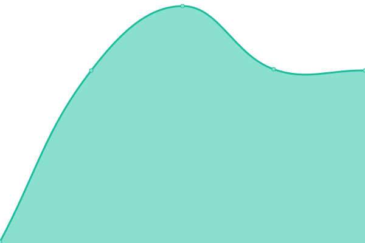
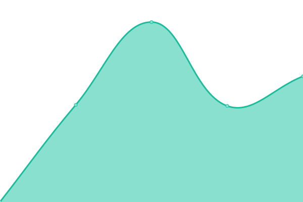
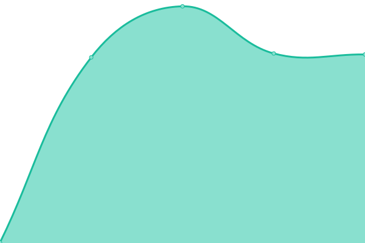

# [📈 Live Status](https://surreal-ai.github.io/upptime): <!--live status--> **🟩 All systems operational**

This repository contains the open-source uptime monitor and status page for [surreal](https://surreal-ai.github.io/upptime), powered by [Upptime](https://github.com/upptime/upptime).

With [Upptime](https://upptime.js.org), you can get your own unlimited and free uptime monitor and status page, powered entirely by a GitHub repository. We use [Issues](https://github.com/surreal-ai/upptime/issues) as incident reports, [Actions](https://github.com/surreal-ai/upptime/actions) as uptime monitors, and [Pages](https://surreal-ai.github.io/upptime) for the status page.

<!--start: status pages-->
<!-- This summary is generated by Upptime (https://github.com/upptime/upptime) -->
<!-- Do not edit this manually, your changes will be overwritten -->
<!-- prettier-ignore -->
| URL | Status | History | Response Time | Uptime |
| --- | ------ | ------- | ------------- | ------ |
|  [www.surreal.la/home](https://www.surreal.la/home) | 🟩 Up | [www-surreal-la-home.yml](https://github.com/surreal-ai/upptime/commits/HEAD/history/www-surreal-la-home.yml) | 

 752ms
     
 | 

<a href="https://surreal-ai.github.io/upptime/history/www-surreal-la-home">100.00%</a>
    

|  [www.surreal.la/ai-renaissance](https://www.surreal.la/ai-renaissance) | 🟩 Up | [www-surreal-la-ai-renaissance.yml](https://github.com/surreal-ai/upptime/commits/HEAD/history/www-surreal-la-ai-renaissance.yml) | 

 156ms
     
 | 

<a href="https://surreal-ai.github.io/upptime/history/www-surreal-la-ai-renaissance">100.00%</a>
    

|  [Product](https://product.surreal-ai.com) | 🟩 Up | [product.yml](https://github.com/surreal-ai/upptime/commits/HEAD/history/product.yml) | 

 1076ms
     
 | 

<a href="https://surreal-ai.github.io/upptime/history/product">100.00%</a>
    

|  [Vinci](https://vinci.surreal-ai.com) | 🟩 Up | [vinci.yml](https://github.com/surreal-ai/upptime/commits/HEAD/history/vinci.yml) | 

 1044ms
     
 | 

<a href="https://surreal-ai.github.io/upptime/history/vinci">100.00%</a>
    

|  [Craft](https://craft-api.surreal-ai.com/v1/health_check) | 🟩 Up | [craft.yml](https://github.com/surreal-ai/upptime/commits/HEAD/history/craft.yml) | 

 1544ms
     
 | 

<a href="https://surreal-ai.github.io/upptime/history/craft">100.00%</a>
    

|  [/ai-presenter-v3](https://craft-api.surreal-ai.com/ai-presenter-v3) | 🟩 Up | [ai-presenter-v3.yml](https://github.com/surreal-ai/upptime/commits/HEAD/history/ai-presenter-v3.yml) | 

 412ms
     
 | 

<a href="https://surreal-ai.github.io/upptime/history/ai-presenter-v3">100.00%</a>
    

<!--end: status pages-->

[**Visit our status website →**](https://surreal-ai.github.io/upptime)

## 📄 License

- Powered by: [Upptime](https://github.com/upptime/upptime)
- Code: [MIT](./LICENSE) © [surreal](https://surreal-ai.github.io/upptime)
- Data in the `./history` directory: [Open Database License](https://opendatacommons.org/licenses/odbl/1-0/)
