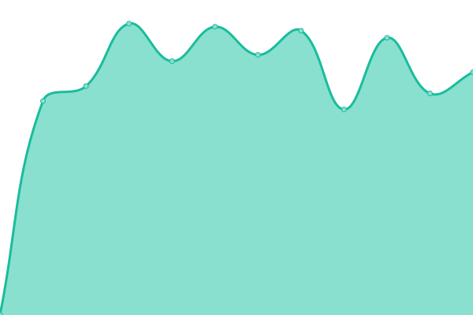

# [📈 Live Status](https://surreal-ai.github.io/upptime): <!--live status--> **🟩 All systems operational**

This repository contains the open-source uptime monitor and status page for [surreal](https://surreal-ai.github.io/upptime), powered by [Upptime](https://github.com/upptime/upptime).

With [Upptime](https://upptime.js.org), you can get your own unlimited and free uptime monitor and status page, powered entirely by a GitHub repository. We use [Issues](https://github.com/surreal-ai/upptime/issues) as incident reports, [Actions](https://github.com/surreal-ai/upptime/actions) as uptime monitors, and [Pages](https://surreal-ai.github.io/upptime) for the status page.

<!--start: status pages-->
<!-- This summary is generated by Upptime (https://github.com/upptime/upptime) -->
<!-- Do not edit this manually, your changes will be overwritten -->
<!-- prettier-ignore -->
| URL | Status | History | Response Time | Uptime |
| --- | ------ | ------- | ------------- | ------ |
|  [homepage](https://www.surreal.la/home) | 🟩 Up | [homepage.yml](https://github.com/surreal-ai/upptime/commits/HEAD/history/homepage.yml) | 

 802ms
     
 | 

<a href="https://surreal-ai.github.io/upptime/history/homepage">100.00%</a>
    

|  [ai-renaissance](https://www.surreal.la/ai-renaissance) | 🟩 Up | [ai-renaissance.yml](https://github.com/surreal-ai/upptime/commits/HEAD/history/ai-renaissance.yml) | 

 182ms
     
 | 

<a href="https://surreal-ai.github.io/upptime/history/ai-renaissance">100.00%</a>
    

|  [Product](https://product.surreal-ai.com) | 🟩 Up | [product.yml](https://github.com/surreal-ai/upptime/commits/HEAD/history/product.yml) | 

 865ms
     
 | 

<a href="https://surreal-ai.github.io/upptime/history/product">100.00%</a>
    

|  [Vinci](https://vinci.surreal-ai.com) | 🟩 Up | [vinci.yml](https://github.com/surreal-ai/upptime/commits/HEAD/history/vinci.yml) | 

 817ms
     
 | 

<a href="https://surreal-ai.github.io/upptime/history/vinci">100.00%</a>
    

|  [ef-api](https://craft-api.surreal-ai.com/v1/health_check) | 🟩 Up | [ef-api.yml](https://github.com/surreal-ai/upptime/commits/HEAD/history/ef-api.yml) | 

 1982ms
     
 | 

<a href="https://surreal-ai.github.io/upptime/history/ef-api">100.00%</a>
    

|  [extend-api](https://extend-api.surreal-ai.com/v1/extend/health_check) | 🟩 Up | [extend-api.yml](https://github.com/surreal-ai/upptime/commits/HEAD/history/extend-api.yml) | 

 980ms
     
 | 

<a href="https://surreal-ai.github.io/upptime/history/extend-api">100.00%</a>
    

|  [talking-avatar](https://craft-api.surreal-ai.com/v1/talking_avatar/health_check) | 🟩 Up | [talking-avatar.yml](https://github.com/surreal-ai/upptime/commits/HEAD/history/talking-avatar.yml) | 

 220ms
     
 | 

<a href="https://surreal-ai.github.io/upptime/history/talking-avatar">100.00%</a>
    

|  [movio](https://craft-api.surreal-ai.com/pacific/v1/pacific/health_check) | 🟩 Up | [movio.yml](https://github.com/surreal-ai/upptime/commits/HEAD/history/movio.yml) | 

 219ms
     
 | 

<a href="https://surreal-ai.github.io/upptime/history/movio">100.00%</a>
    

<!--end: status pages-->

[**Visit our status website →**](https://surreal-ai.github.io/upptime)

## 📄 License

- Powered by: [Upptime](https://github.com/upptime/upptime)
- Code: [MIT](./LICENSE) © [surreal](https://surreal-ai.github.io/upptime)
- Data in the `./history` directory: [Open Database License](https://opendatacommons.org/licenses/odbl/1-0/)
